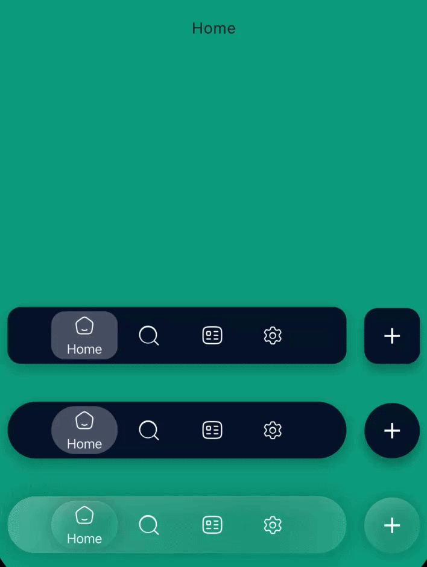

# Floatica
<p align="center">

</p>


<!-- الصف الأول -->
<p align="center">
  <a href="https://pub.dev/packages/floatica">
    
  </a>
  <a href="https://pub.dev/packages/floatica/score">
    
  </a>
  <a href="https://pub.dev/packages/floatica/score">
    
  </a>
  <a href="https://pub.dev/packages/floatica/score">
    
  </a>
  <a href="LICENSE">
    
  </a>
</p>

<!-- الصف الثاني -->
<p align="center">
  <a href="https://flutter.dev/">
    
  </a>
  <a href="https://flutter.dev/">
    
  </a>
  <a href="https://flutter.dev/">
    
  </a>
  <a href="https://flutter.dev/">
    
  </a>
  <a href="https://flutter.dev/">
    
  </a>
</p>

---

A highly customizable floating navigation bar for Flutter with glassmorphism effects, expandable menus, per-tab floating action buttons, and iOS 26 Liquid Glass support. Zero external dependencies.

<p align="center">
  
</p>

---

## Features

- **Floating Navigation Bar** — Beautifully animated bottom navigation with smooth tab transitions
- **Glassmorphism & Liquid Glass** — Built-in glass effects with blur, specular highlights, inner shadows, and frosted noise textures (inspired by iOS 26)
- **Expandable Menu** — Optional overlay menu that animates from the nav bar with barrier blur/dim
- **Per-Tab Floating Action Button** — Each tab can have its own FAB with independent styling and Hero animation support
- **Multiple Shape Styles** — Circle (pill), Rectangle, and Squircle shapes for the nav bar and tabs
- **Tab Indicators** — Background, dot, underline, or no indicator styles
- **Display Modes** — Icon only, title only, or icon + title with label positioning (right or bottom)
- **Programmatic Menu Control** — `FloaticaMenuController` to open, close, or toggle the menu from code
- **Haptic Feedback** — Optional haptic response on tab selection
- **Badge Support** — Attach badge widgets to any tab
- **Gradient Support** — Apply gradients to selected/unselected tab states
- **Fully Themeable** — Colors, text styles, sizes, animations, and more are all customizable
- **Zero Dependencies** — Only depends on Flutter SDK

---

## Installation

Add `floatica` to your `pubspec.yaml`:

```
flutter pub add flexible_sheet
```
Or

```yaml
dependencies:
  floatica: ^1.0.0
```

Then run:

```bash
flutter pub get
```

---

## Quick Start

```dart
import 'package:floatica/floatica.dart';

Scaffold(
  extendBody: true,
  bottomNavigationBar: FloatyNavBar(
    selectedTab: selectedTab,
    tabs: [
      FloaticaTab(
        isSelected: selectedTab == 0,
        onTap: () => changeTab(0),
        title: 'Home',
        icon: const Icon(Icons.home, size: 20),
      ),
      FloaticaTab(
        isSelected: selectedTab == 1,
        onTap: () => changeTab(1),
        title: 'Search',
        icon: const Icon(Icons.search, size: 20),
      ),
      FloaticaTab(
        isSelected: selectedTab == 2,
        onTap: () => changeTab(2),
        title: 'Profile',
        icon: const Icon(Icons.person, size: 20),
      ),
    ],
  ),
);
```

> **Note:** Use `extendBody: true` on your `Scaffold` so the content renders behind the floating bar.

---

## Customization

### FloatyNavBar

| Property | Type | Default | Description |
|---|---|---|---|
| `tabs` | `List<FloaticaTab>` | **required** | List of navigation tabs |
| `selectedTab` | `int` | **required** | Index of the currently selected tab |
| `height` | `double` | `60` | Height of the nav bar |
| `gap` | `double` | `16` | Spacing between tabs |
| `margin` | `EdgeInsetsGeometry?` | `symmetric(vertical: 16)` | Outer margin around the bar |
| `backgroundColor` | `Color?` | Theme primary | Background color |
| `boxShadow` | `List<BoxShadow>?` | Default shadow | Custom box shadows |
| `shape` | `FloaticaShape` | `CircleShape()` | Shape of the nav bar |
| `glassEffect` | `FloaticaGlassEffect?` | `null` | Glassmorphism effect config |
| `menu` | `FloaticaMenu?` | `null` | Expandable menu configuration |

---

### FloaticaTab

| Property | Type | Default | Description |
|---|---|---|---|
| `isSelected` | `bool` | **required** | Whether this tab is currently selected |
| `title` | `String` | **required** | Tab label text |
| `icon` | `Widget` | **required** | Tab icon widget |
| `onTap` | `VoidCallback` | **required** | Callback when tab is tapped |
| `floatyActionButton` | `FloaticaActionButton?` | `null` | Floating action button for this tab |
| `selectedColor` | `Color?` | Theme primary | Background when selected |
| `unselectedColor` | `Color?` | Transparent | Background when not selected |
| `selectedGradient` | `Gradient?` | `null` | Gradient when selected (overrides color) |
| `unselectedGradient` | `Gradient?` | `null` | Gradient when not selected |
| `selectedDisplayMode` | `FloaticaTabDisplayMode` | `iconAndTitle` | Display mode when selected |
| `unselectedDisplayMode` | `FloaticaTabDisplayMode` | `iconOnly` | Display mode when not selected |
| `labelPosition` | `FloaticaLabelPosition` | `right` | Label position relative to icon |
| `indicatorStyle` | `FloaticaIndicatorStyle` | `background` | Tab indicator style |
| `indicatorColor` | `Color?` | `null` | Custom indicator color |
| `iconSize` | `double` | `20` | Icon size |
| `selectedIconSize` | `double` | `20` | Icon size when selected |
| `badge` | `Widget?` | `null` | Badge widget overlay |
| `animationDuration` | `Duration?` | `200ms` | Tab animation duration |
| `animationCurve` | `Curve?` | Default curve | Tab animation curve |
| `enableHaptics` | `bool` | `false` | Enable haptic feedback on tap |
| `tooltip` | `String?` | `null` | Accessibility tooltip |
| `glassEffect` | `FloaticaGlassEffect?` | `null` | Per-tab glass effect |
| `width` | `double?` | `null` | Fixed tab width |
| `height` | `double?` | `null` | Fixed tab height |
| `margin` | `EdgeInsetsGeometry` | `horizontal: 4` | Tab margin |

---

### Shapes

```dart
// Pill shape (default)
FloatyNavBar(
  shape: const CircleShape(),       // radius: 100
  ...
);

// Rounded rectangle
FloatyNavBar(
  shape: const RectangleShape(),    // radius: 12
  ...
);

// Squircle (continuous corners)
FloatyNavBar(
  shape: const SquircleShape(),     // radius: 24
  ...
);
```

---

### Glass Effects

Floatica includes built-in presets for glassmorphism and iOS 26 Liquid Glass:

```dart
// Light glass
FloatyNavBar(
  glassEffect: const FloaticaGlassEffect.light(),
  ...
);

// Dark glass
FloatyNavBar(
  glassEffect: const FloaticaGlassEffect.dark(),
  ...
);

// iOS 26 Liquid Glass
FloatyNavBar(
  glassEffect: const FloaticaGlassEffect.liquidGlass(),
  ...
);

// iOS 26 Liquid Glass (Clear variant)
FloatyNavBar(
  glassEffect: const FloaticaGlassEffect.liquidGlassClear(),
  ...
);

// Fully custom
FloatyNavBar(
  glassEffect: FloaticaGlassEffect(
    blur: 15,
    opacity: 0.25,
    tintColor: Colors.white,
    borderColor: Colors.white24,
    borderWidth: 1.5,
    enableShadow: true,
    specularHighlight: true,
    innerShadow: true,
    saturationBoost: 1.2,
    noiseOpacity: 0.05,
  ),
  ...
);
```

---

### Floating Action Buttons

Attach a FAB to any tab — it appears above the nav bar when that tab is selected:

```dart
FloaticaTab(
  ...
  floatyActionButton: FloaticaActionButton(
    icon: const Icon(Icons.add),
    onTap: () => print('FAB tapped!'),
    size: 54,
    backgroundColor: Colors.blueAccent,
    foregroundColor: Colors.white,
    shape: const CircleBorder(),
  ),
);
```

FABs also support Hero animations via the `heroTag` parameter:

```dart
FloaticaActionButton(
  heroTag: 'profile-avatar',
  icon: ClipOval(child: Image.asset('assets/avatar.png')),
  onTap: () => Navigator.push(...),
);
```

---

### Expandable Menu

Add an expandable overlay menu to the nav bar:

```dart
FloatyNavBar(
  menu: FloaticaMenu(
    icon: const Icon(Icons.apps, size: 18, color: Colors.white),
    title: 'Menu',
    borderRadius: BorderRadius.circular(32),
    barrierColor: const Color(0x40000000),
    barrierBlur: 4.0,
    child: Padding(
      padding: const EdgeInsets.all(20),
      child: Wrap(
        spacing: 16,
        runSpacing: 16,
        alignment: WrapAlignment.center,
        children: [
          _menuItem(Icons.description, Colors.blue, 'Docs'),
          _menuItem(Icons.videocam, Colors.purple, 'Clips'),
          _menuItem(Icons.dashboard, Colors.orange, 'Dashboard'),
        ],
      ),
    ),
  ),
  ...
);
```

#### Programmatic Menu Control

```dart
final menuController = FloaticaMenuController();

// In your widget
FloatyNavBar(
  menu: FloaticaMenu(
    controller: menuController,
    onMenuToggle: (isOpen) => print('Menu is ${isOpen ? "open" : "closed"}'),
    ...
  ),
  ...
);

// Control from anywhere
menuController.open();
menuController.close();
menuController.toggle();

// Check state
print(menuController.isOpen);
```

---

### Tab Indicators

```dart
// Background highlight (default)
FloaticaTab(indicatorStyle: FloaticaIndicatorStyle.background, ...);

// Dot indicator
FloaticaTab(indicatorStyle: FloaticaIndicatorStyle.dot, ...);

// Underline indicator
FloaticaTab(indicatorStyle: FloaticaIndicatorStyle.underline, ...);

// No indicator
FloaticaTab(indicatorStyle: FloaticaIndicatorStyle.none, ...);
```

---

### Display Modes

```dart
// Icon + title when selected, icon only when not
FloaticaTab(
  selectedDisplayMode: FloaticaTabDisplayMode.iconAndTitle,
  unselectedDisplayMode: FloaticaTabDisplayMode.iconOnly,
  labelPosition: FloaticaLabelPosition.bottom,  // or .right
  ...
);

// Title only
FloaticaTab(
  selectedDisplayMode: FloaticaTabDisplayMode.titleOnly,
  unselectedDisplayMode: FloaticaTabDisplayMode.titleOnly,
  ...
);
```

---

## Full Example

Check the [example](example/) directory for a complete working app demonstrating all features including glass effects, expandable menus, per-tab FABs, and Hero animations.

```bash
cd example
flutter run
```

---

## API Reference

| Class | Description |
|---|---|
| `FloatyNavBar` | Main floating navigation bar widget |
| `FloaticaTab` | Configuration for each navigation tab |
| `FloaticaActionButton` | Floating action button attached to a tab |
| `FloaticaMenu` | Expandable overlay menu configuration |
| `FloaticaMenuItem` | Individual menu item data model |
| `FloaticaMenuController` | Programmatic controller to open/close/toggle menu |
| `FloaticaGlassEffect` | Glassmorphism and Liquid Glass effect configuration |
| `CircleShape` | Pill-shaped nav bar (default) |
| `RectangleShape` | Rounded rectangle nav bar |
| `SquircleShape` | Continuous corner (squircle) nav bar |

### Enums

| Enum | Values |
|---|---|
| `FloaticaTabDisplayMode` | `iconOnly`, `titleOnly`, `iconAndTitle` |
| `FloaticaLabelPosition` | `right`, `bottom` |
| `FloaticaIndicatorStyle` | `background`, `dot`, `underline`, `none` |

---

## License

This project is licensed under the MIT License — see the [LICENSE](LICENSE) file for details.